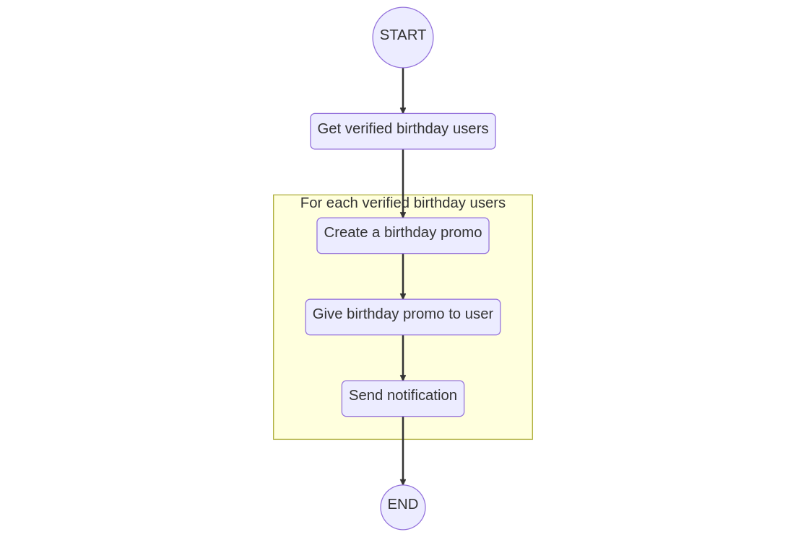
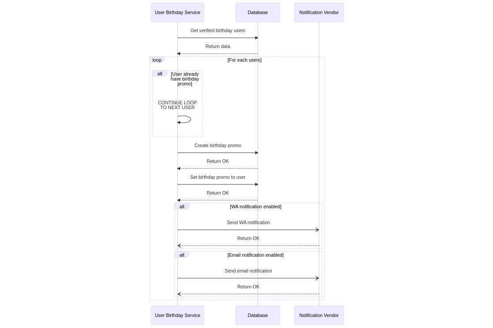
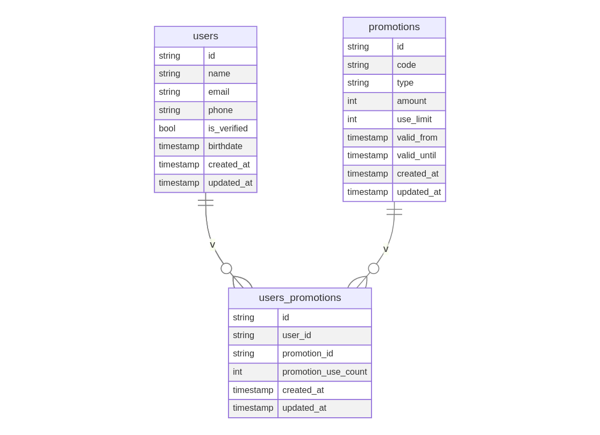

# User Birthday Promo

A scheduler to send promo notifications.

## How to use

- To install dependency, run `go mod tidy`
- To run test, run `make all-test`
- To run program, run `make run`

See `.env` to do config setups

| No | Key                      | Value (example) | Description                                                              |
|----|--------------------------|-----------------|--------------------------------------------------------------------------|
| 1  | USER_BIRTHDAY_CRON_EVENT | @every 1h       | See https://pkg.go.dev/github.com/robfig/cron#hdr-CRON_Expression_Format |

### Dependency

- Go (`go1.18.7`)
- `make` command
- Docker (`20.10.15`)

## Diagrams

### Flow Diagram



```
graph TD
   A((START)) --> B(Get verified birthday users)
   B --> C(Create a birthday promo)
   subgraph For each verified birthday users
       C --> D(Give birthday promo to user)
       D --> E(Send notification)
   end
   E --> Z((END))
```

### Sequence Diagram



```
sequenceDiagram
   participant ubs as User Birthday Service
   participant db as Database
   participant nv as Notification Vendor


   ubs->>db: Get verified birthday users
   db-->>ubs: Return data
   loop For each users
       alt User already have birthday promo
           ubs->>ubs: CONTINUE LOOP<br>TO NEXT USER
       end


       ubs->>db: Create birthday promo
       db-->>ubs: Return OK
       ubs->>db: Set birthday promo to user
       db-->>ubs: Return OK
       alt WA notification enabled
           ubs-)nv: Send WA notification
           nv--)ubs: Return OK
       end


       alt Email notification enabled
           ubs-)nv: Send email notification
           nv--)ubs: Return OK
       end
   end
```

### ERD



```
erDiagram
  users ||--o{ users_promotions: v
  promotions ||--o{ users_promotions: v
  users ||--o{ users_promotions: v
   users {
      string id
      string name
      string email
      string phone
      bool is_verified
      timestamp birthdate
      timestamp created_at
      timestamp updated_at
  }
   users_promotions {
      string id
      string user_id
      string promotion_id
      int promotion_use_count
      timestamp created_at
      timestamp updated_at
  }
   promotions {
      string id
      string code
      string type
      int amount
      int use_limit
      timestamp valid_from
      timestamp valid_until
      timestamp created_at
      timestamp updated_at
  }
```